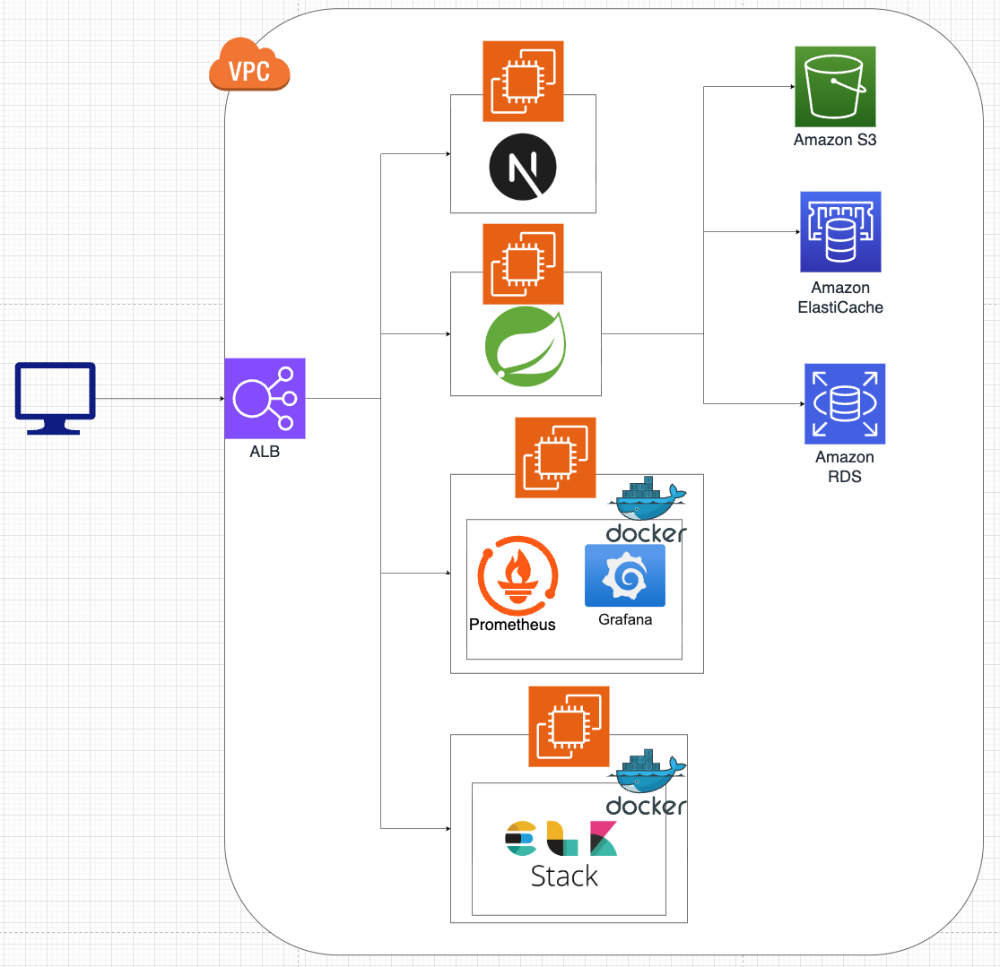

# 🎨 PikUme — AI가 그려주는 나만의 그림 일기장

PikUme는 'Pick your memory'의 줄임말로, 사용자가 자신의 소중한 순간을 AI와 함께 특별한 그림으로 기록하고 친구들과 공유할 수 있는 소셜 다이어리 서비스입니다.

> 글로만 담기 어려운 하루의 감정을, 그림으로 기록하세요.
## ✨ 주요 기능
- 🎨 **AI 그림 일기** - 일기 내용과 캐릭터를 바탕으로 AI 이미지 자동 생성
- 🗓️ **일기 캘린더** - 그림들을 캘린더에서 한눈에 모아보기
- 🧑‍🤝‍🧑 **소셜 피드** - 친구들과 그림 일기를 공유하고 댓글로 소통하기
- 🔔 **실시간 알림** - 친구 요청, 댓글 등 새로운 소식을 실시간으로 받기

## 🛠️ Tech Stack
### Backend

### Frontend

### Infra

## 🏗️ Architecture

## 👨‍👩‍👧‍👦 Team
<table align="center">
  <tbody>
    <tr>
      <td align="center"><a href="https://github.com/hdn1212"> <b>hdn1212</b></a> </td>
      <td align="center"><a href="https://github.com/eilsamo600"> <b>eilsamo600</b></a> </td>
      <td align="center"><a href="https://github.com/apfp77"> <b>apfp77</b></a> </td>
    </tr>
  </tbody>
</table>

## 🔗 Links
- **Backend**: [backend](https://github.com/pikume/piku-back)
- **Frontend**: [frontend](https://github.com/pikume/piku-front)
